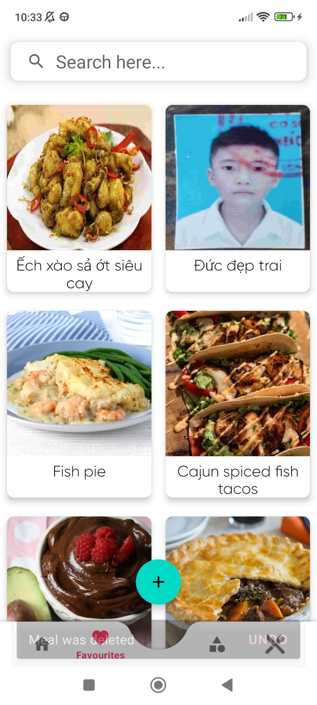

# FoodRecipeApp
FoodRecipeApp is an app that makes making food easier and gives you full information about the selected meal including instructions of how to make that meal provided by a video.

🍱 A Food Recipes App using Kotlin &amp; API (https://www.themealdb.com/api.php) to view food blogs along with their recipes.

# Preview
download apk app : https://www.mediafire.com/file/bo8i02hla8qg25n/app-debug.apk/file

<table style="width:100%">
  <tr>
    <th></th>
    <th></th>
    <th></th>
    <th></th>
  </tr>
  <tr>
    <td></td>
    <td></td>
    <td></td>
    <td></td>
  </tr>
  
 <tr>
    <th></th>
    <th></th>
    <th></th>
    <th></th>
  </tr>
  <tr>
    <td></td>
    <td></td>
    <td></td>
    <td></td>
  </tr>
  
  <tr>
    <th></th>
    <th></th>
    <th></th>
    <th></th>
  </tr>
  <tr>
    <td></td>
    <td></td>
    <td></td>
    <td></td>
  </tr>

  <tr>
    <th></th>
    <th></th>
    <th></th>
  </tr>
  <tr>
    <td></td>
    <td></td>
    <td></td>
    <td></td>

  </tr>
</table>

# Libraries and technologies used
- Navigation component : one activity contains multiple fragments instead of creating multiple activites.
- Retrofit : making HTTP connection with the rest API and convert meal json file to Kotlin/Java object.
- Room : Save meals in local database.
- MVVM & LiveData : Saperate logic code from views and save the state in case the screen configuration changes.
- Coroutines : do some code in the background.
- view binding : instead of inflating views manually view binding will take care of that.
- Glide : Catch images and load them in imageView.
- Firebase : User can register an account, recipes CRUD
